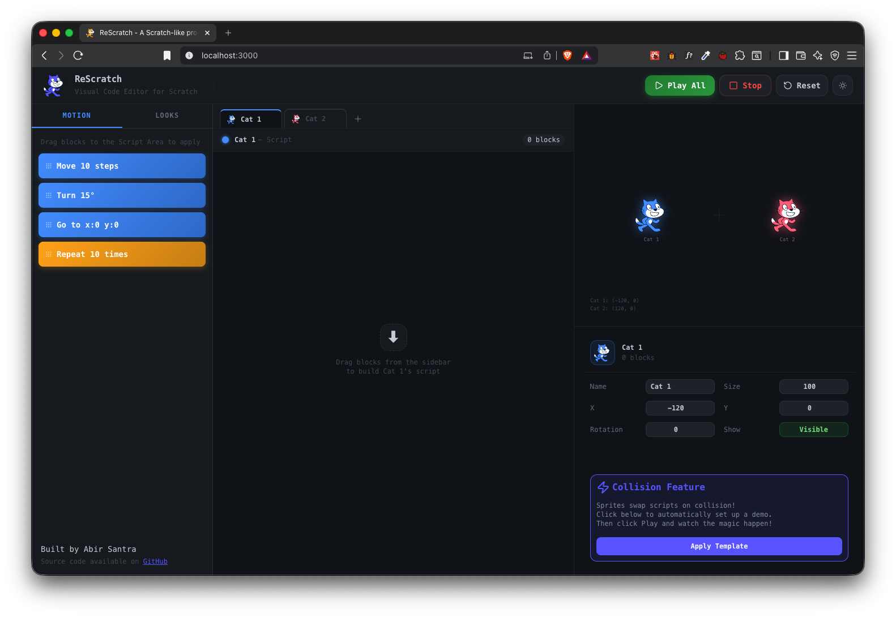
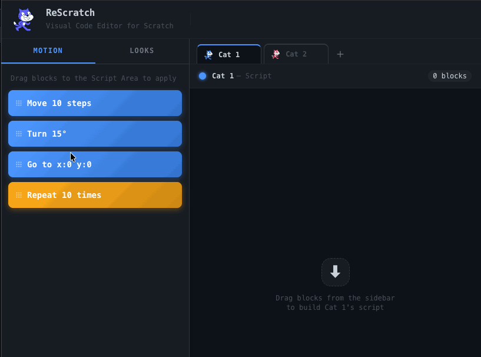
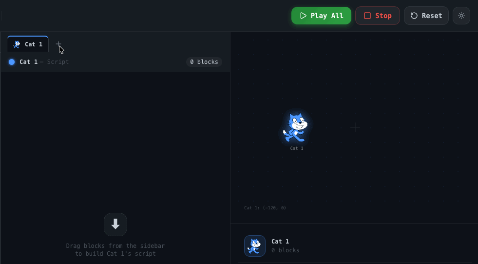
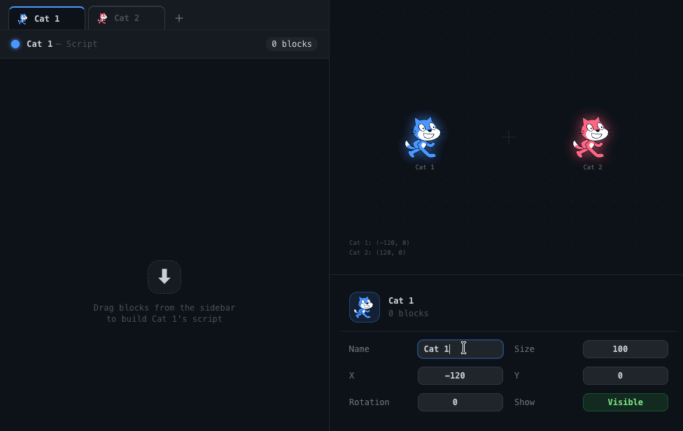
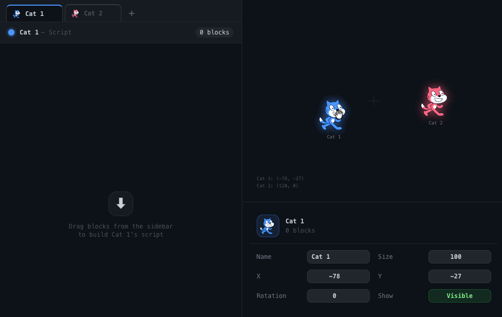
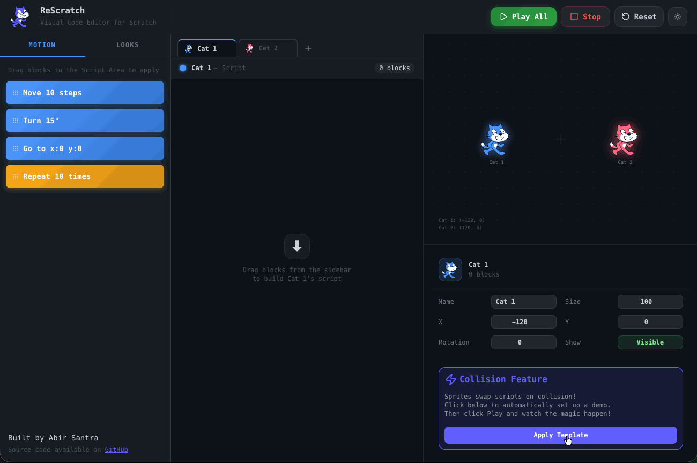
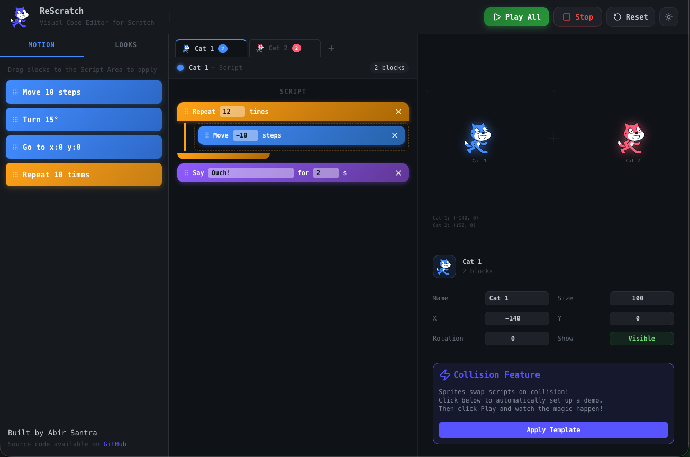
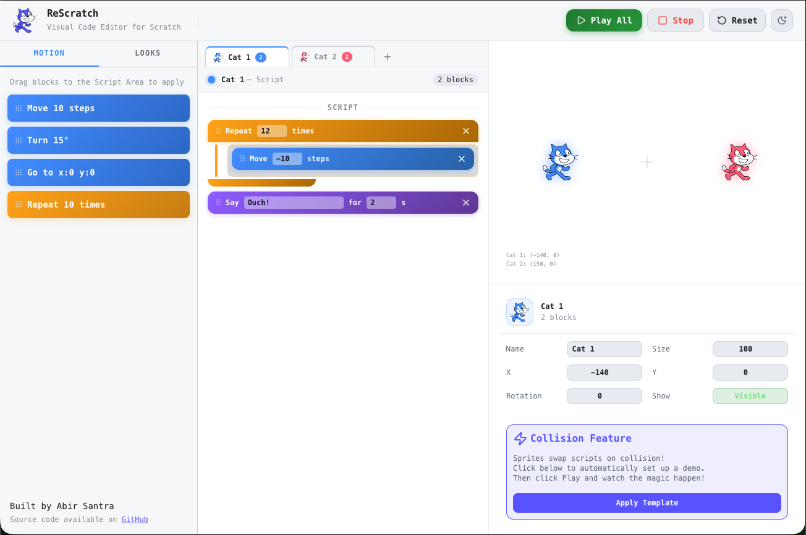

# Re-Scratch

A visual, block-based coding environment built with React, inspired by [MIT Scratch](https://scratch.mit.edu/projects/editor/). Drag and drop blocks to animate sprites on a stage, with support for multiple sprites, collision detection, and dynamic script swapping.

<p align="center">
  
</p>

<p align="center">
  <a href="https://re-scratch.vercel.app/">
    
  </a>
</p>

---

## 🚀 Getting Started

### Prerequisites

- Node.js v16+
- npm v8+

### Installation

```bash
git clone https://github.com/AbirSantra/re-scratch.git
cd scratch-editor
npm install
npm start
```

Open [http://localhost:3000](http://localhost:3000) to view the app.

---

## 🧩 Tech Stack

| Layer            | Technology                |
| ---------------- | ------------------------- |
| UI Framework     | React 18                  |
| State Management | Zustand                   |
| Theme Management | React Context API         |
| Drag and Drop    | react-dnd + HTML5 Backend |
| Styling          | Tailwind CSS              |
| Language         | JavaScript (ES2022)       |

---

## ✨ Features

### Block-Based Scripting

Drag blocks from the sidebar onto a sprite's script area to build animation sequences. Each sprite has its own independent script.

<p align="center">
  
</p>

#### Motion Blocks

| Block                       | Description                                       |
| --------------------------- | ------------------------------------------------- |
| **Move \_\_\_ steps**       | Moves the sprite forward in its current direction |
| **Turn \_\_\_ degrees**     | Rotates the sprite by the given angle             |
| **Go to x: **_ y: _\*\*\*\* | Teleports the sprite to an absolute position      |

#### Looks Blocks

| Block                         | Description                                      |
| ----------------------------- | ------------------------------------------------ |
| **Say **_ for _** seconds**   | Displays a speech bubble for the given duration  |
| **Think **_ for _** seconds** | Displays a thought bubble for the given duration |

#### Control Blocks

| Block                   | Description                                           |
| ----------------------- | ----------------------------------------------------- |
| **Repeat \_\_\_ times** | C-shaped block that repeats the nested blocks N times |

---

### C-Shaped Repeat Block

The repeat block renders as a C-shape with an inner drop zone. Drag any motion or looks block inside the repeat to nest it. Nested blocks execute the specified number of times before the script continues.

<p align="center">
  
</p>

---

### Multiple Sprites

Add as many sprites as you need. Each sprite has its own independent script, position, size, rotation, and color-coded identity. Switch between sprites using the tab bar above the script area. All sprites animate simultaneously when Play is pressed.

<p align="center">
  
</p>

---

### Sprite Control Panel

Select any sprite to configure it via the control panel on the right:

| Property     | Description                            |
| ------------ | -------------------------------------- |
| **Name**     | Rename the sprite                      |
| **X / Y**    | Set the sprite's position on the stage |
| **Size**     | Scale the sprite (10–500%)             |
| **Rotation** | Set the sprite's angle in degrees      |
| **Show**     | Toggle sprite visibility on the stage  |

All controls are locked while animation is playing.

<p align="center">
  
</p>

---

### Stage Drag to Position

When animation is not playing, sprites on the stage are draggable. Click and drag any sprite to set its starting position. The X/Y coordinates in the control panel update in real time as you drag.

<p align="center">
  
</p>

---

### ⚡ Collision Feature — Collision-Based Script Swap

When two sprites collide during animation, their scripts are automatically swapped and both sprites continue animating with each other's blocks.

**Example:**

- Cat 1 starts at x: -120, moves right → collides with Cat 2
- Cat 2 starts at x: 120, moves left → collides with Cat 1
- After collision, Cat 1 moves left and Cat 2 moves right

#### Collision Demo Template

Click the **"Try Demo"** button in the control panel to automatically configure two cats for a collision demonstration. Then hit **Play** to watch it in action.

<p align="center">
  
</p>

---

### Playback Controls

| Button      | Description                                     |
| ----------- | ----------------------------------------------- |
| ▶ **Play**  | Starts animation for all sprites simultaneously |
| ■ **Stop**  | Immediately halts all animations                |
| ↺ **Reset** | Returns all sprites to their starting positions |

---

### Block Reordering

Blocks within a script can be reordered by dragging them up or down within the script area. Nested blocks inside a repeat can be reordered independently of the outer script.

---

### 🌙 Light / Dark Mode

Toggle between light and dark themes using the ☀️ / 🌙 button in the header. The theme preference is managed globally via useTheme hook using React context.

<p align="center">
  
  
</p>

---

## 📁 Project Structure

```
src/
├── App.jsx                          # Root — DndProvider
├── styles/
│   └── theme.css                    # CSS variables for light/dark themes
├── constants/
│   ├── blocks.js                    # Block definitions, DND_TYPES
│   └── stage.js                     # Stage dimensions, initial sprites
├── store/
│   ├── useScratchStore.js           # Zustand store — all app state
│   └── themeStore.jsx               # React Context — light/dark theme
├── hooks/
│   └── useAnimation.js              # Play/stop lifecycle, collision loop
├── utils/
│   ├── animationEngine.js           # Executes block sequences async
│   └── helpers.js                   # checkCollision, sleep, clamp
└── components/
    ├── Header.jsx                   # Playback controls, theme toggle
    ├── Sidebar.jsx                  # Block palette (Motion / Looks tabs)
    ├── SidebarBlock.jsx             # Draggable block in palette
    ├── SpriteTabs.jsx               # Sprite selector tabs
    ├── ScriptArea.jsx               # Drop zone + block list
    ├── BlockChip.jsx                # Individual block (draggable + droppable)
    ├── Stage.jsx                    # Animated sprite canvas
    ├── SpeechBubble.jsx             # Say / Think bubbles
    ├── SpritePanel.jsx              # Sprite control panel
    ├── CatSprite.jsx                # SVG cat sprite
    └── ScratchEditor.jsx            # Main layout
```

---

## 🏗️ Architecture

### State Management — Zustand

All application state lives in a single Zustand store (`useScratchStore`). State is divided into:

- **Sprite state** — positions, rotations, sizes, visibility, scripts
- **Playback state** — `isPlaying`, `collisionHandled`
- **UI state** — `selectedSpriteId`

Block operations use recursive tree helpers to support nested blocks inside repeat.

### Theme Management — React Context

Light/dark theme state is managed via React Context (`ThemeContext`). The active theme is applied as a `data-theme` attribute on the document root, which toggles a set of CSS variables defined in `theme.css`.

### Drag and Drop — react-dnd

Two drag sources and two drop targets:

| Source          | Target           | Effect                               |
| --------------- | ---------------- | ------------------------------------ |
| `SIDEBAR_BLOCK` | `ScriptArea`     | Adds block to sprite's script        |
| `SIDEBAR_BLOCK` | `RepeatDropZone` | Adds block inside repeat's children  |
| `SCRIPT_BLOCK`  | `BlockChip`      | Reorders blocks within the same list |

---

### Animation Engine

The animation engine lives in `utils/animationEngine.js` and is responsible for executing a sprite's block list sequentially, step by step, with real-time position updates.

#### How it works

Each sprite's script is executed by `executeBlocks`, an async function that iterates through the block list and processes each block one at a time using `async/await`. This ensures blocks run sequentially — each block fully completes before the next one starts.

```
executeBlocks(spriteId, blocks, store, signal)
    └── runOnce(blockList)
            ├── MOVE   → update x/y → sleep 100ms
            ├── TURN   → update rotation → sleep 100ms
            ├── GOTO   → update x/y → sleep 300ms
            ├── SAY    → show bubble → sleep Ns → hide bubble
            ├── THINK  → show bubble → sleep Ns → hide bubble
            └── REPEAT → runOnce(children) × N times
```

All sprites run **concurrently** via `Promise.all` in `useAnimation.js` — each sprite gets its own `executeBlocks` call running in parallel, giving the appearance of simultaneous animation.

#### Sleep and timing

Between each block step, `sleep(ms, signal)` is called — a Promise-based delay that resolves after the given milliseconds. Unlike `setTimeout`, this sleep is **abort-aware**: it accepts an `AbortSignal` and rejects immediately with an `AbortError` if the signal is triggered, allowing the animation to halt mid-step without waiting for the current delay to expire.

```js
function sleep(ms, signal) {
  return new Promise((resolve, reject) => {
    const timer = setTimeout(resolve, ms);
    signal.addEventListener("abort", () => {
      clearTimeout(timer);
      reject(new DOMException("Aborted", "AbortError"));
    });
  });
}
```

#### AbortController — stopping animation

Every animation run is tied to an `AbortController`. When the user presses **Stop**, `controller.abort()` is called which:

1. Triggers the `abort` event on the signal
2. The active `sleep()` rejects immediately with `AbortError`
3. `executeBlocks` propagates the rejection up and exits
4. All sprites stop simultaneously since they share the same signal

There are actually **two levels** of abort controllers in play:

| Controller                        | Purpose                                                                            |
| --------------------------------- | ---------------------------------------------------------------------------------- |
| **Outer controller** (`abortRef`) | Tied to the Stop button — kills everything                                         |
| **Round controller**              | Created per animation round — aborted on collision to restart with swapped scripts |

---

### useAnimation Hook

`useAnimation.js` is the orchestration layer that sits between the UI controls (Play/Stop buttons) and the animation engine. It manages the full lifecycle of a playback session.

#### Responsibilities

- Starting and stopping animation runs
- Creating and managing `AbortController` instances
- Running the collision round loop
- Cleaning up speech bubbles on stop

#### The Round Loop

The hook runs animation in a `while` loop where each iteration is one "round". A round ends either when all sprites finish their scripts naturally, or when a collision aborts it early. The loop continues as long as a collision occurred in the previous round:

```js
while (collisionOccurred && !controller.signal.aborted) {
  store.getState().setCollisionHandled(false);

  const roundController = new AbortController();
  controller.signal.addEventListener("abort", () => roundController.abort());

  const collisionPoller = setInterval(() => {
    if (store.getState().collisionHandled) {
      roundController.abort();
    }
  }, 50);

  await runAllSprites(roundController.signal).catch(() => {});
  clearInterval(collisionPoller);

  collisionOccurred = store.getState().collisionHandled;
}
```

#### Two-Level Abort System

Each playback session has two abort controllers working together:

```
User presses Play
      │
      ▼
Outer AbortController (abortRef)
      │
      ├── Passed to roundController via event listener
      │       └── Aborting outer automatically aborts current round
      │
      └── User presses Stop → outer.abort()
                │
                ▼
            roundController.abort()
                │
                ▼
            sleep() rejects → executeBlocks exits → all sprites stop
```

This two-level design means:

- **Stop button** kills everything immediately via the outer controller
- **Collision** only kills the current round via the round controller, allowing the loop to continue with swapped scripts

#### Cleanup

The `finally` block in `play` always runs regardless of how the animation ends — natural completion, Stop button, or error. It sets `isPlaying` to false and clears any speech bubbles that were active at the moment of stopping, preventing bubbles from getting stuck on screen.

```js
finally {
  setPlaying(false);
  store.getState().sprites.forEach((s) => {
    if (s.speechBubble) {
      store.getState().updateSprite(s.id, { speechBubble: null });
    }
  });
}
```

### Collision Detection

Collision detection uses **AABB (Axis-Aligned Bounding Box)** — the simplest and most performant method for checking overlap between two rectangular regions. Since sprites don't rotate their hitbox (only their visual), this works reliably.

```js
function checkCollision(s1, s2) {
  return (
    Math.abs(s1.x - s2.x) < SPRITE_SIZE && Math.abs(s1.y - s2.y) < SPRITE_SIZE
  );
}
```

After every individual block step executes, `detectAndHandleCollision` is called for the active sprite. It iterates over all other sprites and checks if any overlap with the current sprite's position. The first collision found triggers the swap.

A `collisionHandled` boolean flag in the Zustand store ensures the swap only happens **once per round** — without it, both sprites would independently detect the same collision and trigger a double swap, cancelling each other out.

---

### Collision Management — The Round Loop

Managing what happens after a collision is the most complex part of the system. Here's the full lifecycle:

```
Play pressed
    │
    ▼
Round starts — setCollisionHandled(false)
    │
    ▼
All sprites animate concurrently (Promise.all)
    │
    ├── Collision poller runs every 50ms
    │       └── collisionHandled becomes true?
    │               └── abort roundController
    │
    ├── No collision → animation completes normally
    │       └── collisionOccurred = false → exit loop
    │
    └── Collision detected mid-animation
            │
            ▼
        swapBlocks(id1, id2) — scripts exchanged in store
        roundController.abort() — both sprites stop immediately
            │
            ▼
        collisionOccurred = true → start new round
            │
            ▼
        Both sprites re-run with swapped scripts
        from their current positions
```

The **collision poller** is key — it runs on a `setInterval` every 50ms independently of the animation loop. Because both sprites run as separate async functions, there's no single synchronization point where both can be stopped at once. The poller solves this by watching the store from outside and aborting the shared round controller the moment a collision is registered, which simultaneously halts both sprites regardless of where they are in their execution.

---

### Coordinate System

The stage uses a center-origin coordinate system matching Scratch's convention:

- **(0, 0)** is the center of the stage
- **X** increases to the right
- **Y** increases upward (inverted from screen coordinates)

Screen position is derived from sprite coordinates as:

```
screenLeft = STAGE_W / 2 + sprite.x - SPRITE_SIZE / 2
screenTop  = STAGE_H / 2 - sprite.y - SPRITE_SIZE / 2
```

---

### Sprite Rendering — Single SVG, Multiple Instances

Rather than storing or uploading multiple sprite image files, the app uses a single SVG component (`CatSprite.jsx`) that accepts a `color` prop. Every sprite instance in the app is the same SVG file rendered with a different color, eliminating the need to manage multiple assets.

```jsx
// The same component renders differently based on the color prop
<CatSprite color="#4C97FF" /> // Blue cat
<CatSprite color="#FF6680" /> // Pink cat
<CatSprite color="#9966FF" /> // Purple cat
```

#### How it works

The SVG has all its body fill attributes bound to the `color` prop:

```jsx
<path fill={color} ... /> // body, head, tail, arms, legs
```

While non-body parts like eyes, whiskers, nose, and tummy are hardcoded to fixed colors (`#FFFFFF`, `#001026`) since they should remain consistent across all instances regardless of the sprite's color.

#### Color Assignment

When a new sprite is added, a color is automatically picked from a predefined palette in `constants/stage.js` using a circular index:

```js
color: SPRITE_COLORS[count % SPRITE_COLORS.length];
```

This means colors cycle through the palette as more sprites are added, ensuring each sprite looks visually distinct without any user input.

#### Benefits of this approach

- **Zero asset management** — no image uploads, no file storage, no URLs to manage
- **Infinite variety** — any valid CSS color value produces a unique-looking sprite
- **Scalable** — adding 10 sprites costs nothing extra in terms of assets
- **Consistent identity** — color becomes the visual identifier for each sprite, reflected consistently across the stage, sprite tabs, control panel, and block count badges

#### 🔮 Future Feature — Custom Sprite Upload

The current single-SVG approach is intentionally minimal. A natural extension would be allowing users to upload their own sprite images. This would involve:

- An upload button in the sprite control panel or sprite tabs
- Storing the uploaded image as a base64 string or object URL in the sprite's state
- Replacing `<CatSprite color={sprite.color} />` with `` when a custom image is present, falling back to the colored SVG otherwise

This would make the editor far more expressive while keeping the default experience simple and asset-free.

## 🔮 Possible Extensions

- **Forever block** — loop a script indefinitely
- **Event triggers** — "When green flag clicked", "When key pressed"
- **Multiple scripts per sprite** — parallel block stacks
- **More motion blocks** — glide, point towards, bounce off edges
- **More looks blocks** — change costume, set color effect
- **Sound blocks** — play a sound, set volume
- **Custom sprite upload** — allow users to upload their own images for sprites
- **Resizable stage** — allow users to change stage dimensions
- **Mobile support** — touch-friendly drag and drop, responsive layout

---

## 👨‍💻 Author

### Abir Santra

[LinkedIn](https://www.linkedin.com/in/abirsantra/) | [Portfolio](https://www.abirsantra.com/) | [X](https://x.com/the_codefreak)
